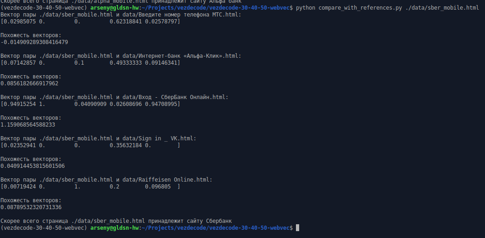

# vezdecode-30-40 ML
### В этом репозитории - решения задания 30, 40 ML трэка

### before you start
* install pipenv
### install
```
git clone git@github.com:ProtsenkoAI/vezdecode-30-40-50-webvec.git
cd vezdecode-30-40-50-webvec/
pipenv install
pipenv shell
```
# ML 30
### run in cmd
скрипт выдаёт извлечённые из файла данные
```
python ./get_html_features.py <PATH_TO_FILE>
# example with file from repo
python ./get_html_features.py "./data/Вход - СберБанк Онлайн.html"
```
### run in notebook
Ноутбук, где можно посмотреть данные лежит в /notebooks/view_data.ipynb

### Пояснение к решению
Нужно извлечь данные из html, чтобы по ним понять, принадлежат ли 2 html-файла одному сайту 
(используется в ML 40)

Требования к фичам я поставил такие:
1. Должны извлекаться из чистого HTML
2. На их базе затем можно посчитать качественные метрики, чтобы отличать сайты.

Идея в том, что в разных версиях одного сайта может сильно отличаться разметка - например, 
количество и расположение div'ов. В тоже время, основные компоненты меняются редко - например, 
input'ы на экране входа.

Поэтому я преобразую html в список с фичами, в котором есть 4 категории данных:
* ButtonElem 
* TextElem
* ImageELem 
* InputElem

Для каждого типа реализован класс, который получает полезные для метрик данные и определяет,
  как сравнить два компонента. На базе этих классов строятся все метрики в ML 40.

#### Преимущества такого извлечения фич
1. Зависит от смысловых компонентов страницы (тексты, кнопки, input'ы), а не от особенностей
разметки
2. Разбиение на классы позволяет в 5-7 строчек получать сложные аггрегации, например, метрику
  intersection over union (IoU), и сравнения сложных по структуре объектов (например, svg)


# ML 40
### run in cmd 
скрипт выдаёт вектора для данного сайта и списка из условия(окна входа ВК, Сбер и тд), 
а также похожесть сайта на каждый сайт из списка
```
python ./compare_with_references.py <PATH_TO_FILE>
# example with file from repo
python ./compare_with_references.py "./data/Вход - СберБанк Онлайн.html"
```

### Пояснение к решению
Основное предположение - решение должно считать похожими страницы одного и того же сайта,
ведь мы хотим отличать сайты друг от друга. В таком случае, можно составить выборку из мобильных
и десктопных версий одних и тех же сайтов.

Основываясь на этом, мы строим регрессию, которая будет предсказывать, насколько два
сайта похожи:
1. Для каждого сайта, данного вездекодом, извлекаются попарные фичи (их список ниже)
   для всех скачанных пар страниц.
2. Модель (в данном случае - sklearn.linear_model.LinearRegression для простоты) предсказывает, взяты ли
  страницы с одного сайта. Обучение модели находится в notebooks/EDA.ipynb.
   
Обученная регрессионная модель используется для определения похожести.

### Вектора страниц
Вектора составляются из фич пары страниц - того, насколько их компоненты совпадают.

Код извлечения фич находится в feature_extraction.py

Список фич (и intuition, зачем мы их добавили)
* [IoU или Jackard](https://en.wikipedia.org/wiki/Jaccard_index) - балансирует оценку, насколько совпадают компоненты
сайтов.
* hrefs IoU - совпадание ссылок между сайтами. Если мошеннический сайт сделает полную копию оригинала, но подменит ссылки,
эта метрика упадёт.
* [intersection_inversions_index](https://wiki.algocode.ru/index.php?title=%D0%9A%D0%BE%D0%BB%D0%B8%D1%87%D0%B5%D1%81%D1%82%D0%B2%D0%BE_%D0%B8%D0%BD%D0%B2%D0%B5%D1%80%D1%81%D0%B8%D0%B9) - количество перестановок компонентов. Характеризует, насколько совпадает порядок элементов
на странице.
* component_types_mismatch - растёт, если две страницы обладают похожей структурой - нормализованным количеством 
InputElem, ButtonElem, .... Позволяет лучше соединять версии одной страницы для разных устройств.
* [words_similarity](https://en.wikipedia.org/wiki/Jaccard_index) - формула как у IoU, но для слов на странице. У многих компаний сайт хорошо характеризуется используемым
лексиконом, поэтому также повышает качество регрессии.
  
### Пример вывода
##### дополнительные файлы для тестирования находятся в data/
